# Hadoop

### Conceitos de Big Data, escalabilidade e cluster

- **Cluster:**

- **Nó ou Nodes:**

- **Daemon:**

- **Computação serial:**

- **Computação distribuída:**

- **Escalabilidade vertical:**

- **Escalabilidade Horizontal:**


### O que é o Hadoop

### Arquitetura do Hadoop

### Common

### MapReduce

### Yarn

### HDFS

### Monitoramento de cluster Hadoop de alto nível com HDFS e Yarn

Primeiro vamos instalar a Oracle VM VirtualBox, mas antes disso precisa ter instalado o Pacote Redistribuível do Microsoft Visual C++ 2019 para isso entre no site:

https://learn.microsoft.com/pt-br/cpp/windows/latest-supported-vc-redist?view=msvc-170#visual-studio-2015-2017-2019-and-2022

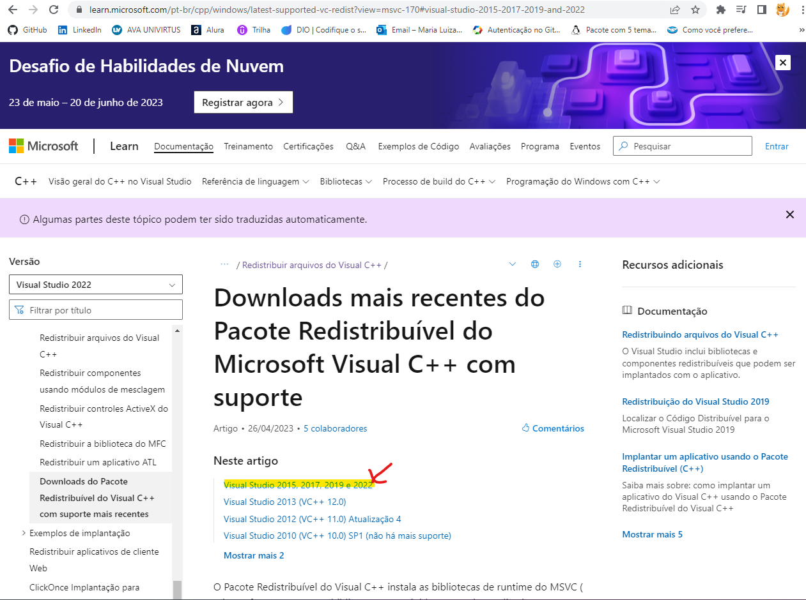

Dentre as três versões escolha a mais adequada para seu SO.

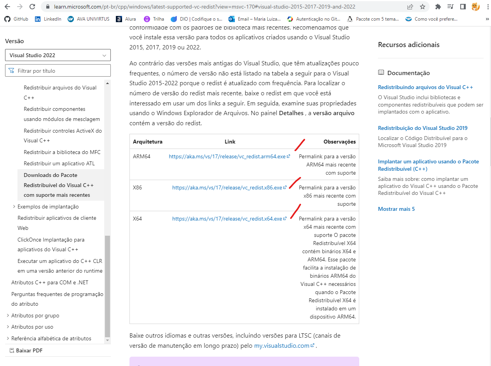

Agora acesse o seguinte endereço para fazer o download da Oracle VM VirtualBox:

https://www.oracle.com/br/virtualization/technologies/vm/downloads/virtualbox-downloads.html

Escolha a versão adequada para seu SO.

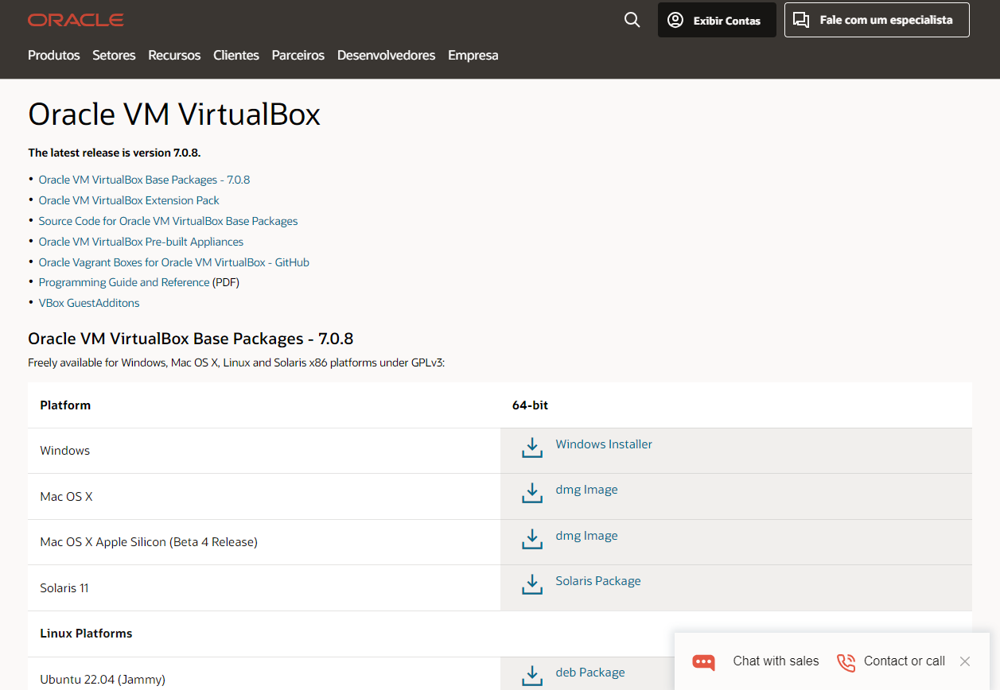

Obtenha a VM que será usada para realizar esse procedimento no seguinte link:

https://drive.google.com/file/d/1CsHc311jp4EuZ8be5KGaumniGAafa8sC/view?usp=sharing

Abra o local onde salvou o arquivo e de dois cliques no arquivo:

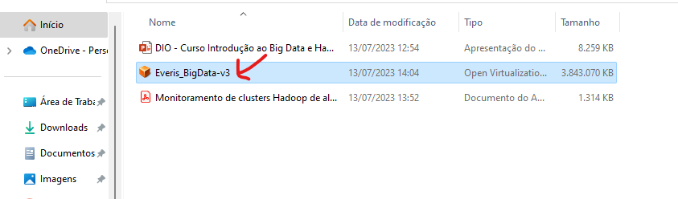

Ou você pode abrir o Oracle VM VirtualBox, clicar em:

Arquivo -> Importar Apliance

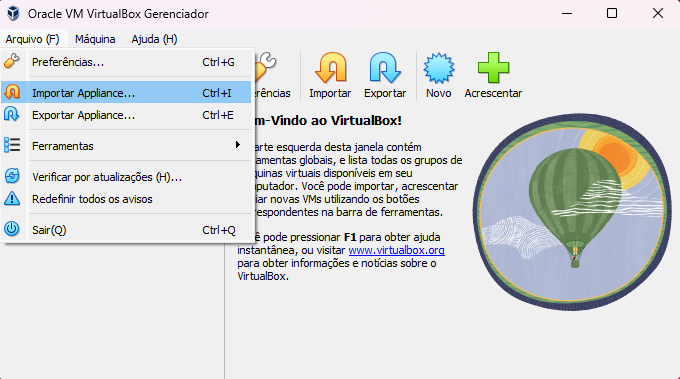

Na tela que aparece clique na pastinha, escolha o arquivo que foi baixado e clique em próximo.

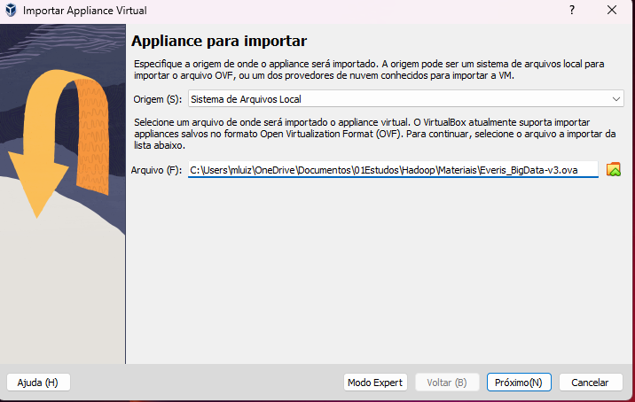

Na próxima tela, você pode escolher a pasta para a VM que será criada ou pode deixar na padrão. Depois clique em finalizar.

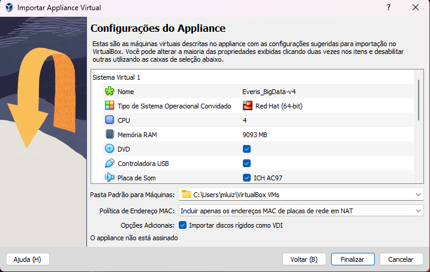

Sua máquina virtual será criada, espere até o processo ser concluído

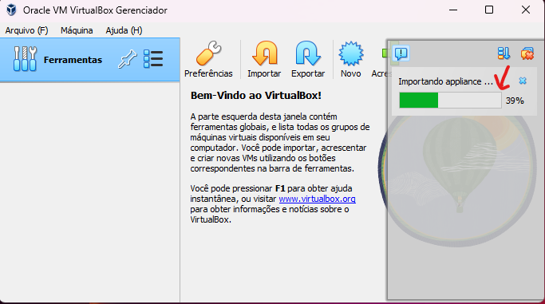

Quando o processo for concluído você deve obter a seguinte imagem:


Selecione a VM, e clique em configurações. Na tela a seguir clique em sistema.

Caso tenha um computador com mais de 8GB de memória você pode aumentar a memória de sua VM para que ela fique mais rápida. O Ideal é que a VM só use metade da memória que o computador dispõe:

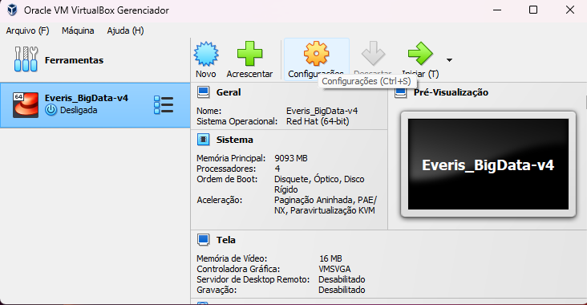

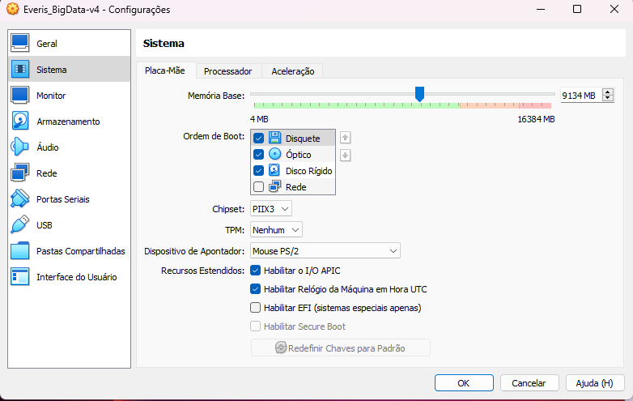

Você também precisa mudar as configurações de rede, ecolha a opção ```Placa em modo Bridge```

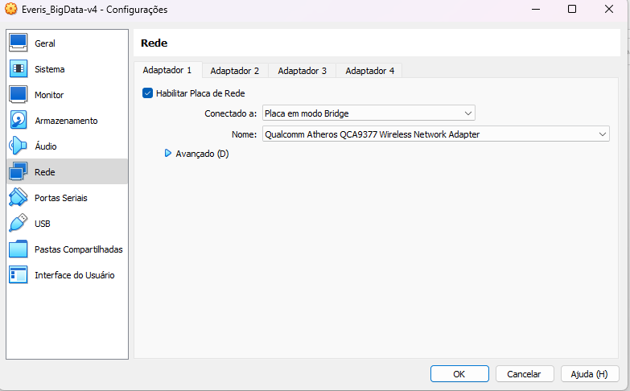

Agora vamos Startar a máquina. Clique em iniciar:


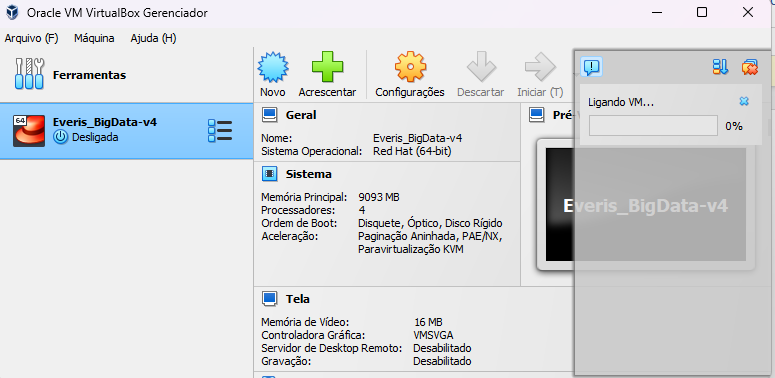


Na tela que abriu vai pedir usuário e senha:

**Usuário:** everis

**Senha:** everis2021

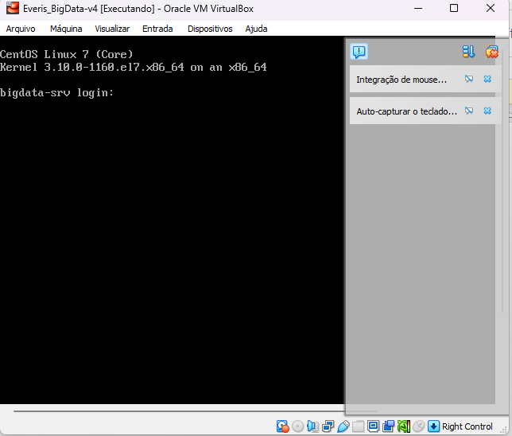

Após o login, ficará assim:

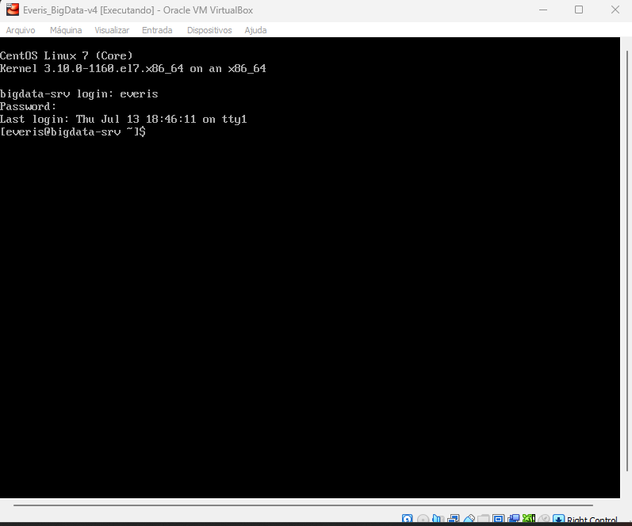

O terminal da VM é muito limitado, por isso vamos usar o MobaXterm para executar os comandos.

Você pode baixar o Moba no link abaixo. Escolha a opção Installer edition.

https://mobaxterm.mobatek.net/download-home-edition.html

Abra o Moba e clique em Start local terminal

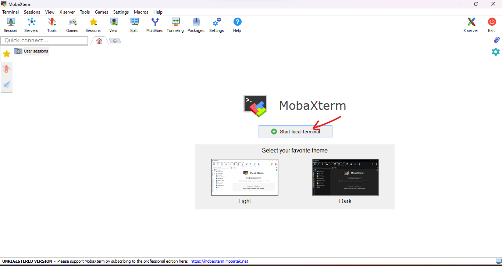

Volte para a VM e em seu terminal digite

``` ip addr show ```

Ele mostrara os IPs da rede da VM, escolha o segundo, anote o ***inet***, exceto os números após a barra:

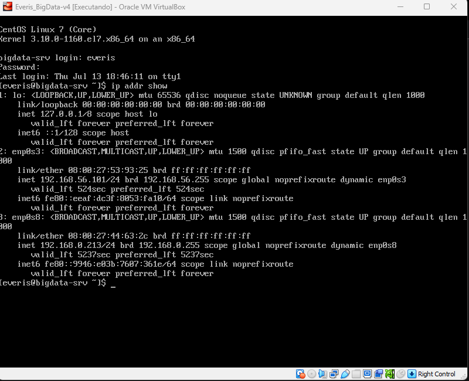

Agora no terminal do Moba, digite o seguinte comando:

```ssh digite o IP aqui -l everis```

Ele vai pedir a senha, digite a mesma do passo anterior (everis2021) 


Após isso ele vai abrir uma tela pedindo para ciar uma senha para criptografar suas senhas, é opcional.

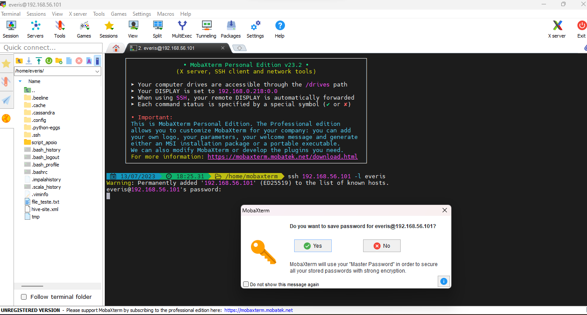


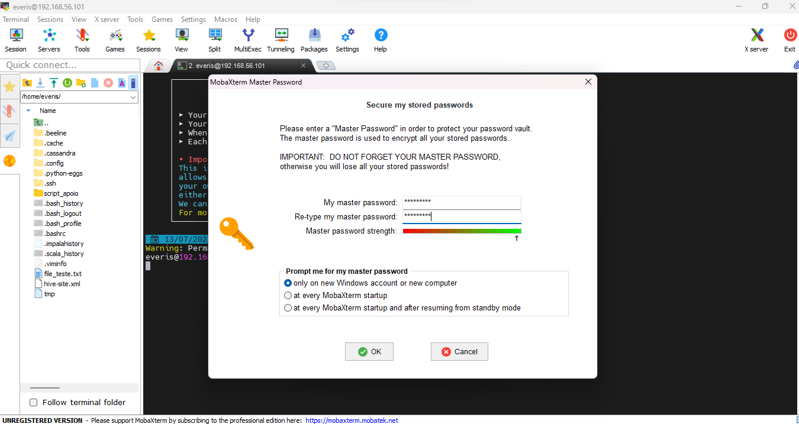


Agora vamos Startar cada um dos serviços, copie e cole, um por um, cada serviço da lista a baixo: 

```
sudo service hadoop-hdfs-namenode start
```
```
sudo service hadoop-hdfs-secondarynamenode start
```
```
sudo service hadoop-hdfs-datanode start
```
```
sudo service hadoop-mapreduce-historyserver start
```
```
sudo service hadoop-yarn-resourcemanager start
```
```
sudo service hadoop-yarn-nodemanager start
```

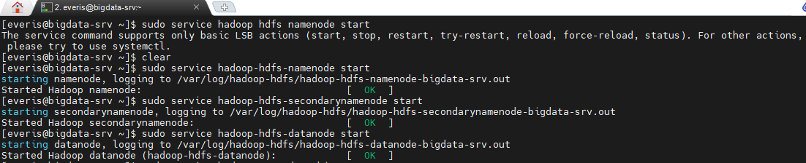

Agora vamos aprender a criar arquivo HDFS para local.
No Moba digite ```ll``` ou  ```ls``` para listar os arquivos da pasta, é para aparecer apenas esses arquivos:

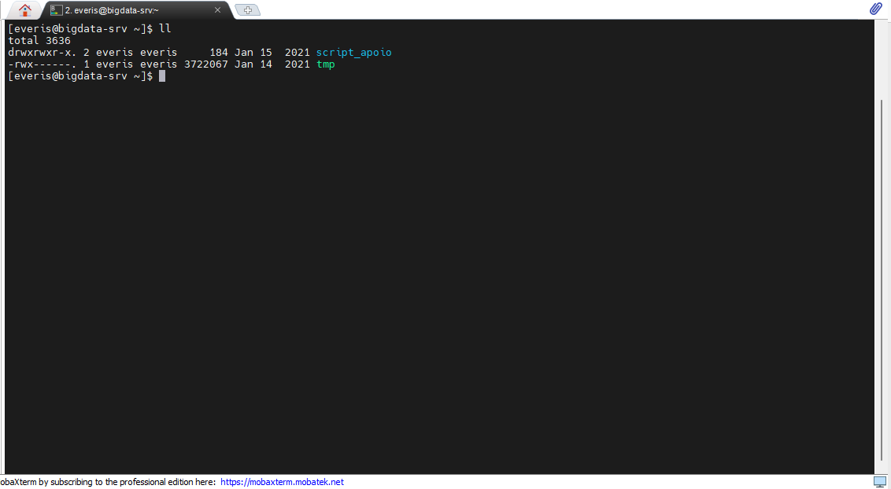

Caso apareça outros arquivos além dos que estão na imagem a cima, use o comando ```rm``` para removelos:

```
rm nome_arquivo
```

Exemplo:

```
rm file_teste.txt
```

Agora digite o seguinte comando para copiar o arquivo file_teste.txt para a pasta local:

```
hdfs dfs -get /tmp/file_teste.txt
```

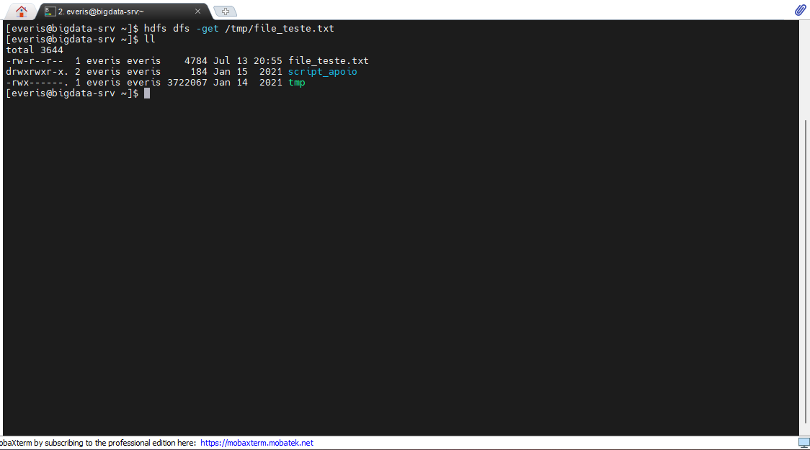

Para você ler esse arquivo é só digitar:

```
cat file_teste.txt
```
Agora que o arquivo está disponível na sua máquina, é hora de colocá-lo no HDFS. Use o seguinte comando:

```
hdfs dfs -put file_teste.txt /user/everis-bigdata/
```
Caso apareça uma mensagem de erro como essa:

```
put: Cannot create file/user/everis-bigdata/file_teste.txt._COPYING_. Name node is in safe mode.

```

Use os seguintes comandos para resolver o problema e tente novamente:

```
sudo -u hdfs hdfs dfsadmin -safemode leave
```

```
sudo -u hdfs hdfs dfs -chmod -R 777 /tmp
```


Agora vamos praticar alguns comandos:


```
hdfs dfs -ls -h /
```
```
hdfs dfs -cat /tmp/file_teste.txt |head -10
```
```
hdfs dfs -mkdir /tmp/delete
```
```
hdfs dfs -cp /tmp/file_teste.txt /tmp/delete/
```
```
hdfs dfs -rm /tmp/delete/file_teste.txt
```
```
hdfs dfs -touchz /tmp/delete/empty_file
```
```
hdfs dfs -rm -R /tmp/delete
```
```
sudo -u hdfs hdfs dfs -du -h /user
```
```
sudo -u hdfs hdfs fsck /tmp/ -files -blocks
```

Pode ser que o Status apareça como CORRUPT quando o correto seria estar como HEALTHY.

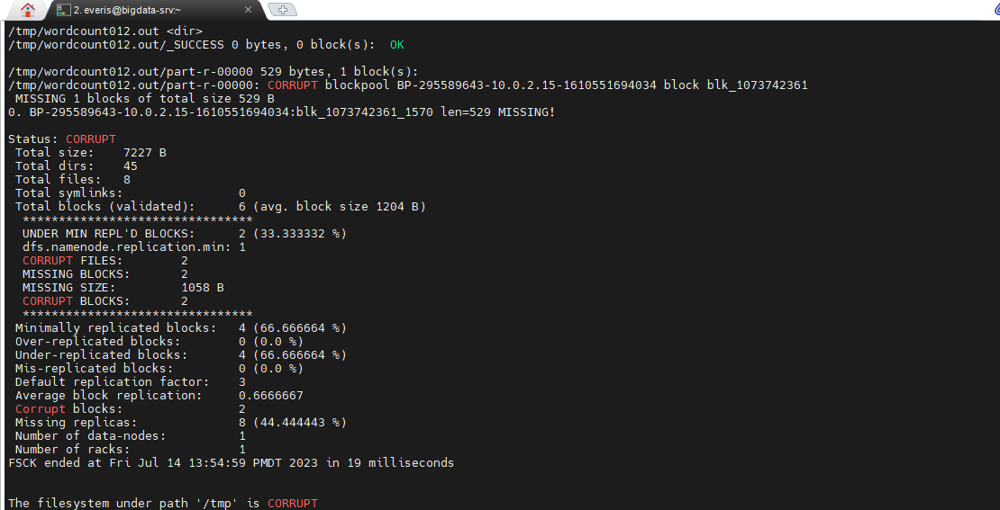

Para resolver isso você precisa analisar todos os erros e resolver o problema dos arquivos que estão corrompidos, aqui no caso vamos apenas apagar os arquivos corrompidos.
Tem duas formas de apagar os arquivos corrompidos, um a um ou tentar reparar o sistema de arquivos executando o comando ```hdfs fsck``` com a opção ```-delete```.
No primeiro caso você vai executar o comando:
``` sudo -u hdfs hdfs dfs -rm /tmp/nome_ou_caminho_doarquivo ```

Exemplo:
``` sudo -u hdfs hdfs dfs -rm /tmp/wordcount00002.out/part-r-00000```

Na segunda opção você pode apenas usar esse comando:
``` sudo -u hdfs hdfs fsck /tmp/ -files -blocks -delete ``` 
Após fazer isso é esperado que quando executar o comando ``` sudo -u hdfs hdfs fsck /tmp/ -files -blocks ``` de novo, o resultado seja esse:

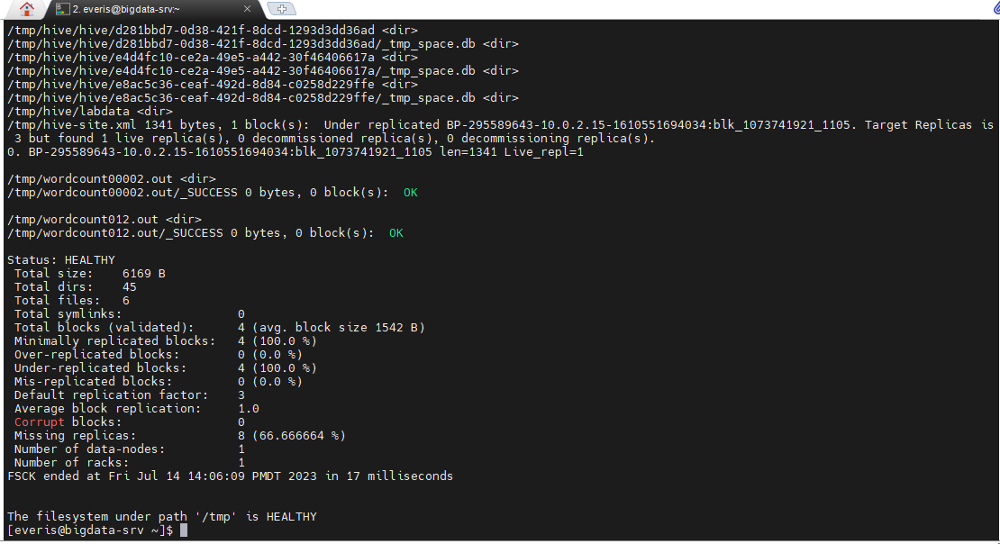

```
sudo sed -i 's|hdfs://|hdfs://bigdata-srv:8020/|g' /etc/hadoop/conf/yarn-site.xml
```

```
sudo -u hdfs yarn jar /usr/lib/hadoop-mapreduce/hadoop-mapreduce-examples.jar wordcount /tmp/file_teste.txt /tmp/wc_output
```

Você deve obter o seguinte resultado:

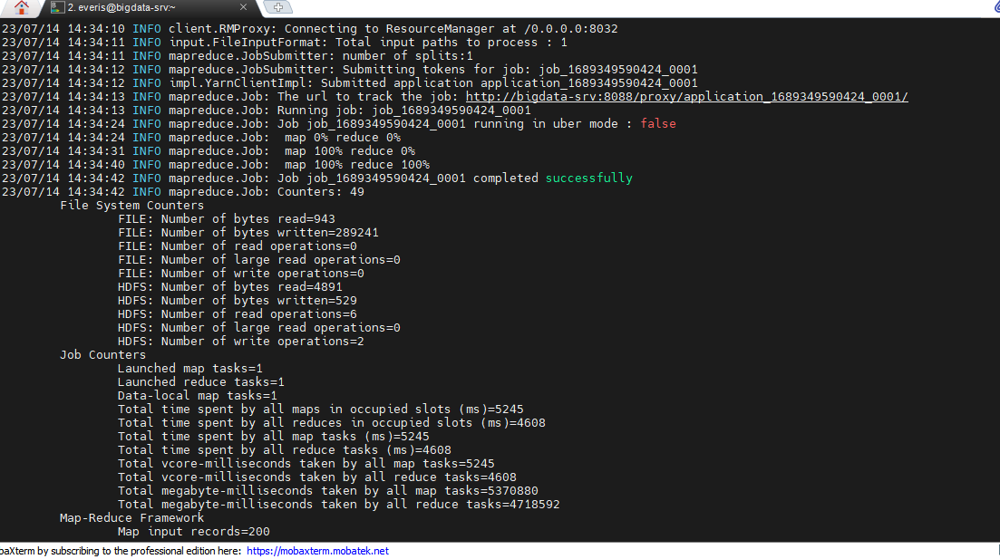
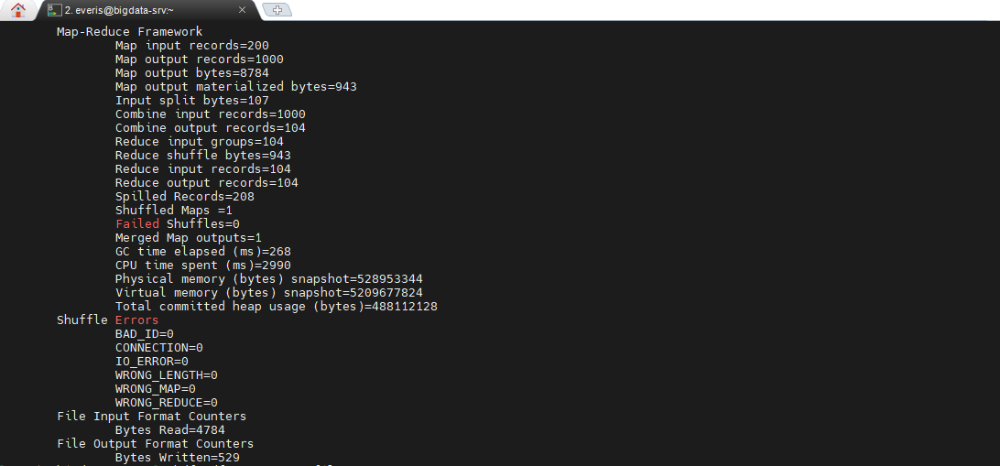

Caso não consiga, pode ser necessário reiniciar os serviços, isso pode ser feito uma a um, é só substituir start por stop nos comandos usados anteriormente, e depois iniciá-los de novo, ou usar o script de apoio:

Parar:

``` sh script_apoio/stop_all_service.sh```

Iniciar:

``` sh script_apoio/start_all_service.sh```

Repetir os passos:

```
sudo sed -i 's|hdfs://|hdfs://bigdata-srv:8020/|g' /etc/hadoop/conf/yarn-site.xml
```

```
sudo -u hdfs yarn jar /usr/lib/hadoop-mapreduce/hadoop-mapreduce-examples.jar wordcount /tmp/file_teste.txt /tmp/wc_output
```


Para ver o arquivo gerado com a contagem, execute o seguinte comando para saber o nome do arquivo:

```hdfs dfs -ls -h /tmp/wc_output```

Depois é só fazer a leitura do arquivo usando o ```cat```:

```hdfs dfs -cat /tmp/wc_output/nome_do_arquivo```

Terá uma saída assim:
```
--      200
1       2
10      2
100     2
11      2
12      2
13      2
14      2
15      2
16      2
..
datanode        200
de      200
teste   200
```
Também pode ver o arquivo que foi usado para fazer a contagem:

```hdfs dfs -cat /tmp/file_teste.txt```

Rode a mesma aplicação mudando a pasta de destino ou arquivo de entrada para praticar.

Agora vamos abrir o gerenciador do cluster do Apache Hadoop YARN no seu navegador: 

```seu ip :8088/cluster```

O Ip é o mesmo que usou para iniciar o Moba.

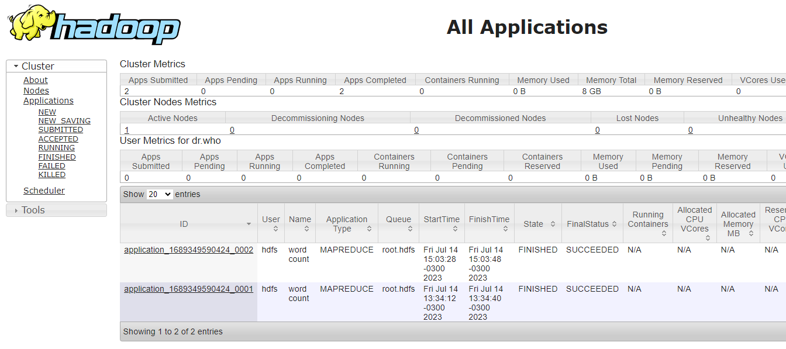

Nele você consegue ver as aplicações que rodou e tem acesso as IDs dessas aplicações que serão úteis nos próximos passos.

Caso não abra, pode ser que precisa parar o firewall, use o seguinte comando e tente novamente:
``` sudo systemctl stop firewalld```

Para obter o log das suas aplicações use o comando:
```sudo -u hdfs yarn logs -applicationId id_da_sua_aplicação |more```


